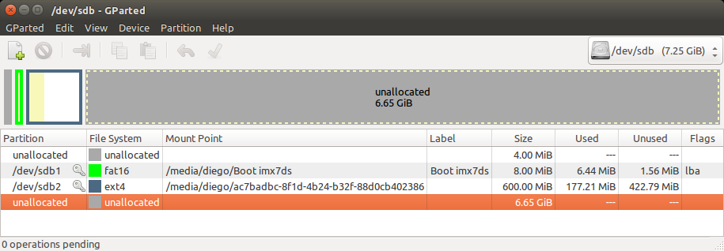

# Embedded Qt with Buildroot

This project provides a Buildroot config and helper scripts to build an 
environment for Qt development on embedded systems. The primary target platform
is the i.MX7D Sabre SD board. The following procedure creates a Buildroot environment
that allows you to compile Qt applications for the platforms supported by
Buildroot. It also creates a root filesystem for the target platform that 
contains a basic embedded Linux environment and the Qt libraries. If you want to
use the root filesystem you will need a SD card. This repository contains an
installation script for the i.MX7 partition layout that copies the root
filesystem to the SD card. This setup allows you to develop Qt applications on
your host system and then deploy to the i.MX7D.

* Buildroot project: http://buildroot.net/
* Qt project: http://www.qt.io/

## License

Buildroot-Qt source code is distributed under the GNU GENERAL PUBLIC LICENSE
Version 3.

## Examples

The examples folder contains a few codes for testing on the target.

* Hello World
* Digital Clock
* Temperature Demo


## Building the system with Qt5

This step builds a complete Linux system including the kernel and the Qt
libraries. You can use the script or do it manually. For the first one, just
download the repository and run the script using sudo.

* Script

```console
 $ git clone https://github.com/diegohdorta/buildroot-qt.git
 $ cd buildroot
 $ sudo ./build-qt.sh
```
* Manually

First you need to download the same repository and Buildroot. We use the current
release `2016-11` of Buildroot, which is the release that supports i.MX7. Just
download and unpack Buildroot into your clone of `buildroot-qt`:


```console
 $ git clone https://github.com/diegohdorta/buildroot-qt.git
 $ cd buildroot-qt
 $ https://buildroot.org/downloads/buildroot-2016.11.tar.gz
 $ tar -xvf buildroot-2016.11.tar.gz
```

Next step we configure buildroot for i.MX7. The folder `config` contains a
Buildroot configuration file to set all options that we need. 
Enter the `buildroot-2016.11` folder and load the configuration:

```console
 $ cd buildroot-2016.11
 $ make config-freescale-qt5_defconfig
```

You can now start the build process. This download and build the toolchain,
Linux and all libraries and applications. The whole procedure might take a
while, up to a few hours. Just run:

```console
 $ make
```

Buildroot saves all results of the building process in the folder `output`.

For graphical output the system supports LinuxFB and EGLFS. The latter is the
default. For more information about the configuration of the platform plugins
and Qt on embedded platforms please visit:

http://doc.qt.io/qt-5/embedded-linux.html


## Preparing SD card

The SD card has to be prepared with a certain partition layout in order to
be bootable. The standard layout is a small FAT partition and a larger ext4 
partition in this order. The easiest way to prepare the card is to use the
script/format-sdcard.sh. 

*Note: This script may not work in a few machines.

Just follow the image below to create your SD card:




## Installing root filesystem on SD card

This step installs the root filesystem on a SD card that will boot the i.MX7. 

You must extract the root filesystem inside the rootfs partition and also
copy the kernel image and dtb file into boot partition.

```console
 $ cd output/images/
 $ sudo tar -xvf rootfs.tar -C /path/to/rootfs/partition
 $ sudo cp zImage /path/to/boot/partition
 $ sudo cp imx7d-sdb.dtb /path/to/boot/partition
```

## Compiling Qt applications

You can now use the Buildroot `qmake` executable to generate your Qt project.
The command is available in Buildroot's `output/host/usr/bin` directory.

You need to export the path in order to do a cross compiling.
```console
 $ cd build/output/host/usr/bin
 $ PATH=$PWD:$PATH
```

As an example, we compile a simple digital clock. Just check out the code, run
`qmake` followed by `make`:

```console
 $ cd examples/
 $ qmake
 $ make
```
This will build the executable `digitalclock` in the folder directory. You can
now copy the executable to the i.MX7 and run the following command on the
target:

```console
 # ./digitalclock -platform linuxfb
```
* Note: To run the touch screen event, it must be pass the following command:

```console
 # ./demo_imx7 -platform linuxfb -plugin \
   evdevtouch:/dev/input/event[insert event number of your touchscreen here]
```

* Note: If it's a new program you must run first:

```console
 $ qmake -project -d - Wall
```
Then `qmake` and `make`.

## Contact

E-mail: diego.dorta@nxp.com
