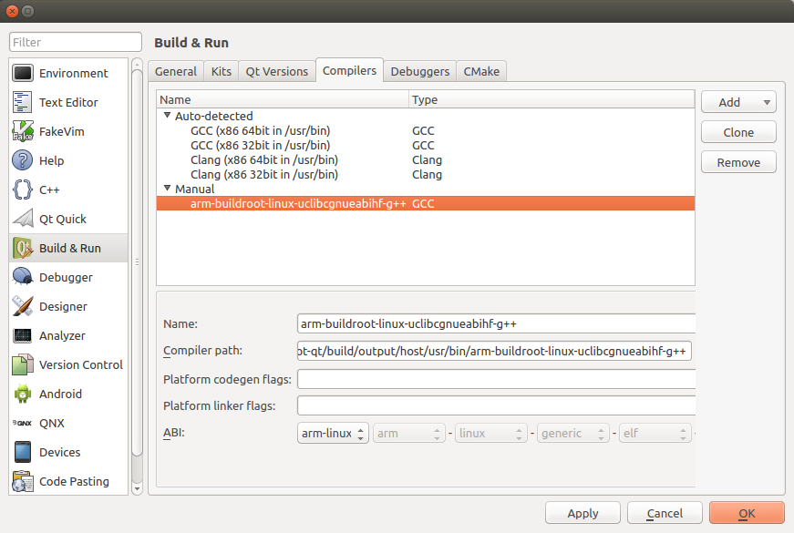
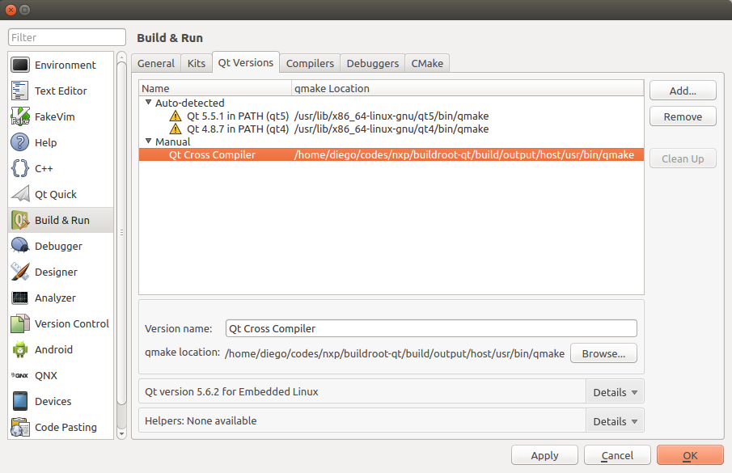
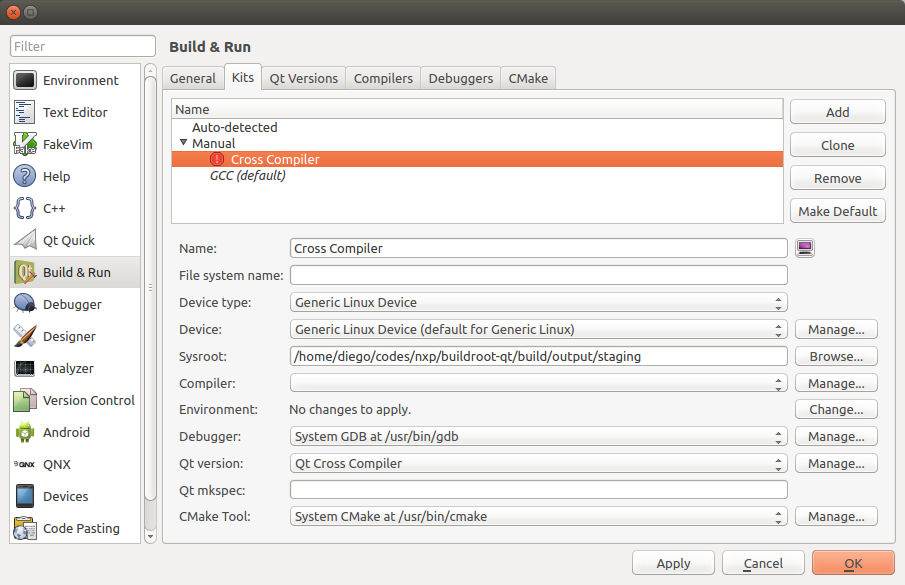

# Setting up Qt Creator for development

This guide expects to help to configure the QT Creator on the host machine.
Before doing these steps, first follow the [README.md](https://github.com/diegohdorta/buildroot-qt/blob/master/README.md).

## Installing QT5 and QT Creator on Ubuntu

First you need to download and install the Qt SDK. You can find all the steps here:

http://wiki.qt.io/Install_qt_5_on_ubuntu

Then, install the QT Creator using the following commands:

```console
$ sudo apt-get install build-essential
$ sudo apt-get install qtcreator
$ sudo apt-get install qt5-default qttools5-dev-tools
```

## Configuring QT Creator

### Compiler

Next, change to the section `Build & Run`. Here it's necessary to add the GCC compiler of Buildroot. Click on the tab `Compilers` and then on `Add -> GCC`. Next to the
field `Compiler path` click on `Browse...` and browse to the Buildroot
directory. The cross-compiler `arm-buildroot-linux-gnueabihf-g++` is stored in
`output/host/usr/bin`, the full path might look something like:

    /path/to/buildroot/buildroot/output/host/usr/bin/arm-buildroot-linux-gnueabihf-g++



### QT Versions

Parallel to the compiler we need to set the path to `qmake` in Buildroot.
Change to the tab `Qt versions` and click on `Add...`. Browse again to the
`output/host/usr/bin` of Buildroot and select the `qmake` there. Don't forget
to set a name for your Qt version:



### Device Kits

The last step is to create a kit from the device, compiler and the Qt version.
You need to click on `Apply` now in the dialog so that all settings are stored.
Change to the tab `Kits` and click `Add`. Now enter a name for the kit and
choose the device, compiler and Qt version that you just created from the
drop-down lists:



To store your settings click `OK` in the dialog.

## Running a Qt project

This step shows how to open and compile a project.

	$ git clone https://github.com/diegohdorta/buildroot-qt.git
  $ cd buildroot-qt/examples/demo_imx7/

Open the project file of demo_imx7 in Qt Creator by choosing
`File -> Open File or Project...` from the menu.

Instead of compiling using QT Creator, I prefer to use QT Creator to edit the
code and the GUI. For compiling, it's easier to compile manually.

    $ cd build/output/host/usr/bin
    $ PATH=$PWD:$PATH

Now, to to the demo_imx7 folder, and type:

    $ qmake -project -d -Wall
    $ qmake

Before typing `make`, make sure the `demo_imx7.pro` has the following lines:

    QT += widgets
    QT += core
    CONFIG+= qt debug c++14

Now, just run `make` and the program starts compiling.

    $ make
