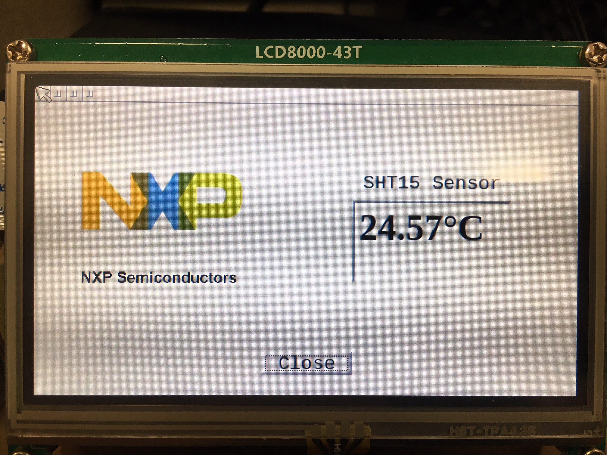

# Temperature demo

## Compiling Qt applications


*Note: You need to export the path in order to cross compiling.

```console
 $ cd build/output/host/usr/bin
 $ PATH=$PWD:$PATH
```

After built the code, go to demo folder:

```console
 $ cd examples/demo_imx7
 $ qmake -project -d -Wall
 $ qmake
```

Open `demo_imx7.pro` and add the following lines:

```console
QT += widgets
QT += core

CONFIG+= qt debug c++14
```
Run `make`:

```console
 $ make
```

This creates the executable `demo_imx7` in the folder directory. Copy the 
executable to the board and run the following command on the target:

```console
 # ./demo_imx7 -platform linuxfb
```

For enabling touch screen, use the plugin parameter to specify the device:

```console
 # ./demo_imx7 -platform linuxfb -plugin \
   evdevtouch:/dev/input/event[insert event number of your touchscreen here]
```

The result is showing below:


