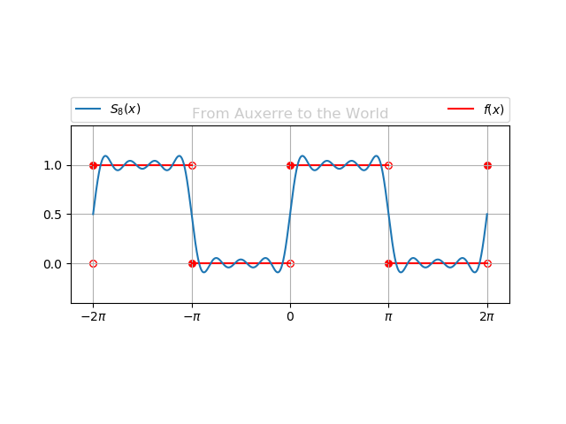

# From Auxerre to the World

## Overview

This code was written for plotting the terms of Fourier series for a `Square Wave`.

## Installation

You must have the following packages installed on your running machine:

* Python
* Matplotlib
* Numpy

You may need root privileges:

```
 $ apt-get install python python-matplotlib python-numpy
```

This code was developed and tested over `Ubuntu 18.04 LTS`.

## Running

For running the code you must enter the n-index term to be calculated.

For instance, if you want to simulate the result of the first 2 terms of fourier series:

```
 $ python code.py 2
```
The code will sum all the terms until 2 and overlay it with a square wave.


Take a look into other examples, as the input increases:

# 8 Terms

```
 $ python code.py 8
```



# 15 Terms

```
 $ python code.py 15
```


# 30 Terms

```
 $ python code.py 30
```


# 50 Terms

```
 $ python code.py 50
```


# 100 Terms

```
 $ python code.py 100
```


You can see that as you increase the input terms the more accurate the result gets.

